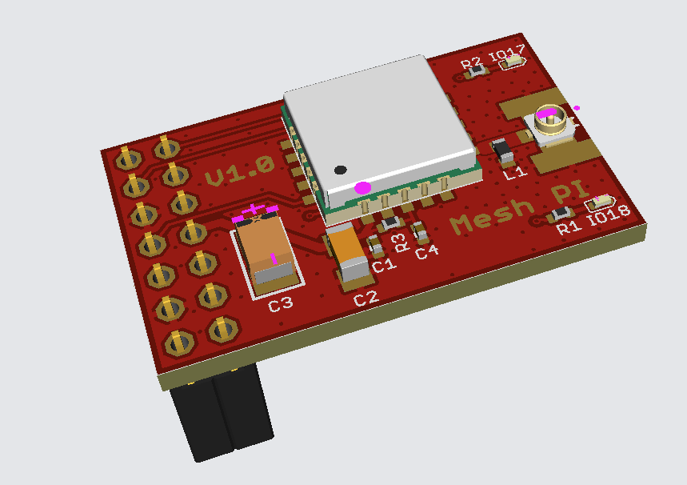
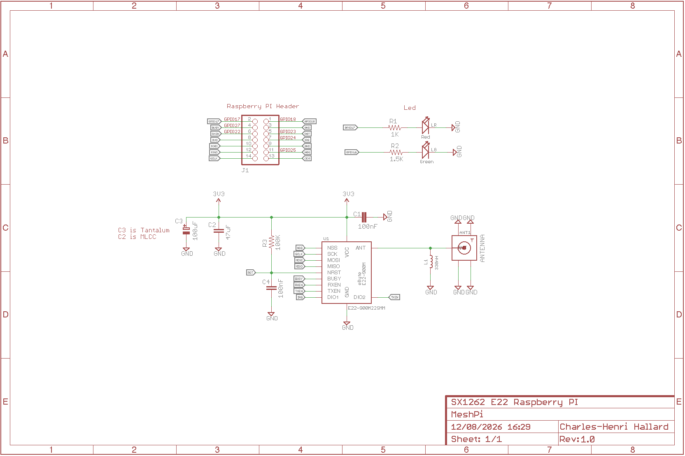
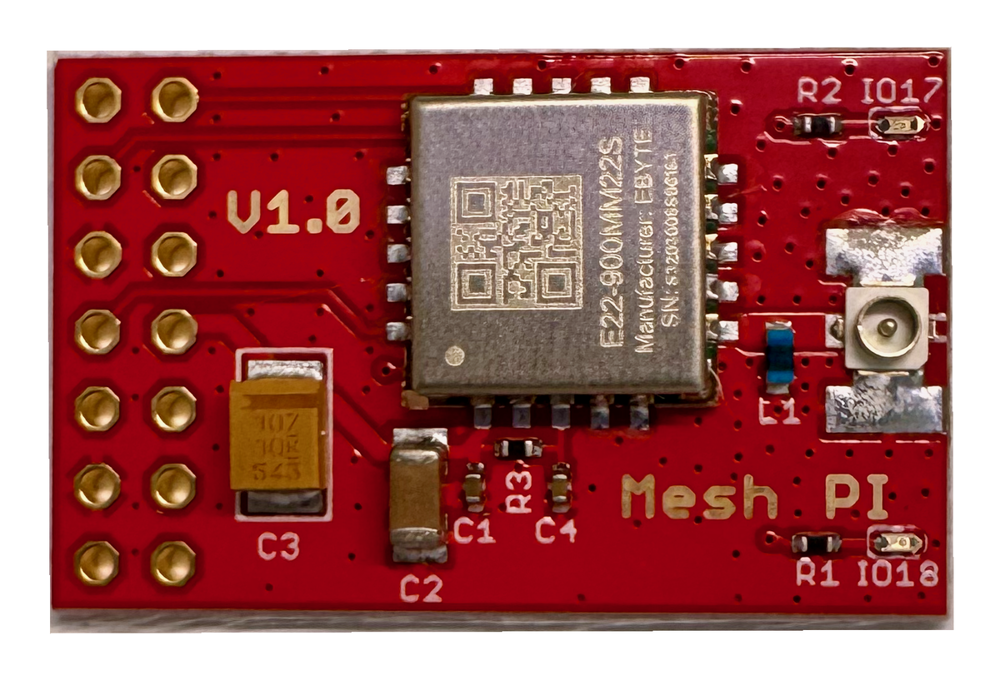
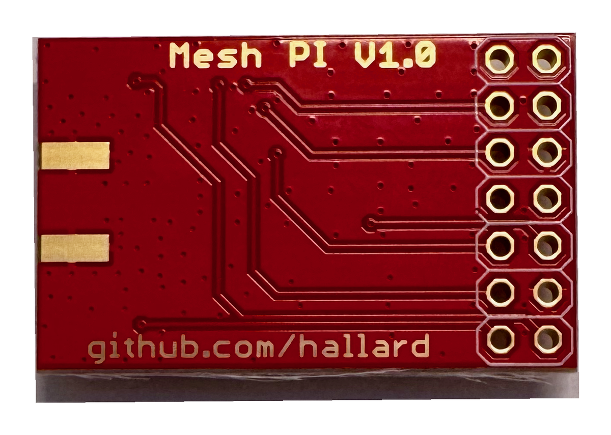

# Mesh-PI — The tiniest SX1262 LoRa board for Raspberry Pi

[](https://meshtastic.org)



**Mesh-PI** is, as far as I know, the **smallest SX1262 LoRa board ever made for the Raspberry Pi**. It's built around the ultra-small **10×10 mm** [Ebyte **E22-900MM22S**][e22] (Semtech **SX1262**, 868/915 MHz) module — the board is barely bigger than the module itself.

It's designed to run [Meshtastic][meshtastic] with the Linux-native daemon [`meshtasticd`][meshtasticd], but since it's just a plain SX1262 on the SPI bus, it works with **any LoRa / LoRa-mesh stack** — Meshtastic, [Reticulum / RNode][reticulum], your own [RadioLib][radiolib] project… Ideal for a compact, always-on **router / MQTT gateway** node, with the full power of Linux behind it: SSH, MQTT, Home Assistant, scripting…

## Features

**Version 1.0**

- Placement for **Ebyte E22-900MM22S** module — SX1262, 868/915 MHz ISM, up to **22 dBm**, ~7 km range, 10×10 mm
- **u.FL** antenna connector — or solder an edge-mount **SMA** connector / wire antenna instead
- **2 status LEDs** (Green = OK, Red = fault) driven from GPIO
- Powered straight from the Pi **3.3 V** rail, with proper bulk + low-ESR decoupling (100 µF tantalum + 47 µF MLCC + 100 nF)
- Designed for **`meshtasticd`** (Meshtastic Linux-native)

## Schematics



SPI is the classic MOSI / MISO / SCLK. **NSS (chip-select) sits on GPIO26** — a free GPIO, *not* CE0 — to avoid the `cs-gpios` conflict of recent Raspberry Pi kernels (meshtasticd / RadioLib drives it directly). The RF switch uses **DIO2 for TX** (`DIO2_AS_RF_SWITCH`) and a GPIO for RX.

```
Raspberry PI            E22-900MM22S (SX1262)
   GPIO26  <---->  NSS   (chip select)
   SCLK    <---->  SCK
   MOSI    <---->  MOSI
   MISO    <---->  MISO
   GPIO23  <---->  NRST  (reset, active low)
   GPIO22  <---->  BUSY
   GPIO24  <---->  DIO1  (IRQ)
   GPIO27  <---->  RXEN
   DIO2    <---->  TXEN  (tied together -> DIO2_AS_RF_SWITCH)
   DIO3    :  not connected  (32 MHz XTAL on module, no TCXO)

Raspberry PI         On Board LEDs
   GPIO18  <---->  Green LED (status OK)
   GPIO17  <---->  Red LED   (fault)
```

## Assembled boards





## Software — meshtasticd

Install the Meshtastic Linux daemon (see the [official docs][meshtasticd]), then declare the radio in `/etc/meshtasticd/config.yaml`:

```yaml
Lora:
  Module: sx1262
  CS: 26
  IRQ: 24
  Busy: 22
  Reset: 23
  RXen: 27
  DIO2_AS_RF_SWITCH: true
  # No DIO3_TCXO_VOLTAGE — the E22-900MM22S uses a passive 32 MHz XTAL, not a TCXO
```

> ⚠️ **Do NOT** set `DIO3_TCXO_VOLTAGE` on this board. The **MM22S** variant is crystal-based; setting it would tell the SX1262 to power a non-existent TCXO and the radio would fail to init (`-707`). *(The larger M22S is TCXO — that's a different module.)*

Enable SPI and set the boot state of the reset / LED pins in `/boot/firmware/config.txt`:

```
dtparam=spi=on

# Keep the radio out of reset from the bootloader (NRST is active-low -> drive high)
gpio=23=op,dh
# LEDs off at boot (active-high -> drive low)
gpio=17,18=op,dl
```

Then set the LoRa region and node role from any Meshtastic client, or the CLI:

```
meshtastic --host localhost --set lora.region EU_868 --set device.role ROUTER
```

## License

This design is licensed under a [Creative Commons Attribution-NonCommercial-ShareAlike 4.0 International License][cc-by-nc-sa] — build it, tweak it, share it, but **not for commercial use**.

[![License: CC BY-NC-SA 4.0][cc-badge]][cc-by-nc-sa]

## Lazy building your own?

If I put a batch of these on [Lectronz][lectronz], you'll be able to order one there.

[][lectronz]

## Misc

News and other projects on my [blog][blog].

[meshtastic]: https://meshtastic.org
[meshtasticd]: https://meshtastic.org/docs/software/linux-native/
[reticulum]: https://reticulum.network/
[radiolib]: https://github.com/jgromes/RadioLib
[e22]: https://www.cdebyte.com/products/E22-900MM22S
[lectronz]: https://lectronz.com/stores/hallard
[cc-by-nc-sa]: https://creativecommons.org/licenses/by-nc-sa/4.0/
[cc-badge]: https://licensebuttons.net/l/by-nc-sa/4.0/88x31.png
[blog]: https://hallard.me
